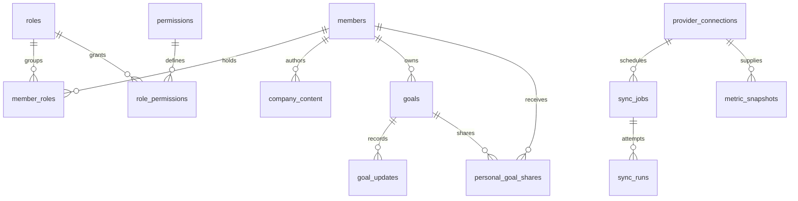

# Task 1.5 — Initial data model

September 16, 2026. Status: Logical design complete; schema names and migrations remain subject to Task 1.6 discovery. This document defines future tables and invariants, not an installed schema. No database or application code is changed by this task.

Inputs: [approved membership policy](MEMBERSHIP_AND_ACCESS.md), [workflow requirements](../FIRST_RELEASE_REQUIREMENTS.md), [stack decision](TECH_STACK.md), and [PA-01 boundaries](PLATFORM_ADMINISTRATION.md).

## Ownership and conventions

The internal Supabase project owns internal members, grants, company information, goals, and integration metadata. Model one internal company initially; do not add customer organizations as internal tenants. Customer-project records and token ledgers remain owned by their source database. Never create cross-project foreign keys or assume shared auth IDs.

Use UUID primary keys, UTC `timestamptz` event timestamps, and `date` for human deadlines interpreted in the company reporting timezone. Mutable records have `created_at`, `updated_at`, and a monotonically increasing `revision` for optimistic concurrency. Historical rows preserve their author. Use foreign keys with restricted deletion for member/business history; explicit archive/deactivation replaces routine deletion. Any eventual purge requires a separate retention policy.

All named tables below are proposed logical names. Put identity/grants/secrets/job internals in a non-client-exposed schema; expose only reviewed projections or functions and RLS-protected business tables. Actual schema placement must follow discovery. UUIDs are identifiers, never authorization tokens.

## Relationships

Additional join tables and access rules are specified below. The diagram omits some relationships for readability.

## Identity, membership, and permissions

| Table | Core fields and relationships | Constraints / purpose |
| --- | --- | --- |
| `company_settings` | Singleton ID, display name, reporting timezone, reporting currency, auth-policy revision | Exactly one company configuration; serializes last-administrator checks. Currency is a presentation preference, not automatic conversion. |
| `members` | ID; unique internal `auth_user_id`; display name; state `active/inactive`; activated/deactivated timestamps; authorization version | Verified internal auth identity only. Preserve member ID through deactivation. No passwords, MFA secrets, or customer subscription state. Email comes from verified identity projection, not an editable authorization field. |
| `roles` | ID; unique code; description | Initial codes: `founder_ceo`, `sales_director`, `systems_architect`. Versioned seed definitions, not browser-created roles. |
| `permissions` | ID; unique code; description | Explicit action catalog; additions require reviewed migrations/configuration. |
| `role_permissions` | Role ID, permission ID | Composite primary key; defines default capabilities. |
| `member_roles` | Member ID, role ID; grantor member ID; granted timestamp | Unique member/role pair. Live grants only; changes recorded in audit. |
| `invitations` | ID; normalized email; token digest; inviter ID; issued/expiry timestamps; state `pending/accepted/revoked/expired`; accepted member ID/time | Unique token digest; one pending invitation per normalized email. Expiry enforced by comparison even before cleanup updates state. Never persist raw token. |
| `invitation_roles` | Invitation ID, role ID | Frozen intended role set; changing roles requires revocation/reissue. |
| `application_sessions` | ID; unique token digest or verified provider-session reference; member ID; created/last-active/reauthenticated timestamps; absolute expiry; revoked timestamp; authorization version | Server-only session constraints from Task 1.3. No raw bearer tokens. Reauthentication evidence must come from verified identity flow. |

Permission catalog baseline: `members.manage`, `members.support_read`, `members.recovery_initiate`, `finance.read`, `sales.read`, `customers.read`, `company_content.manage`, `sales_content.manage`, `technical_content.manage`, `company_goals.manage`, `connections.read_health`, `connections.maintain`, `connections.authorize`, `audit.business_read`, and `audit.support_read`. Common member actions such as reading shared content or updating an assigned goal still have explicit operation and record checks; they do not confer broad manage permission.

CEO role grants required business permissions and membership administration. Sales receives sales/customer and sales-content permissions. IT receives technical-content, minimal account support, and connection-health/maintenance permissions. Restricted customer fields and financial summaries require their separate scoped grants below. Neither role table grants Platform Administration authority or private-goal access.

### Membership transactions

- Accept invitation: lock invitation; verify pending state, expiry, authenticated matching email, inviter's current authority, and allowed intended roles; create member/grants and consume invitation in one transaction. Unique identity/email constraints protect concurrent acceptance. Never silently upgrade an existing active member.
- Change roles/deactivate: serialize through the company-settings lock; recompute whether an active membership administrator remains; apply changes, increment authorization version, revoke sessions as appropriate, and append audit atomically.
- Deactivation also removes current shares to/from the member and scoped discretionary grants. Reassign company work or set company owners to null with an explicit unassigned state. Preserve private goals under their original owner. Reactivation assigns roles explicitly and never restores revoked sharing automatically.

## Company information and operational issues

| Table | Core fields and relationships | Constraints / purpose |
| --- | --- | --- |
| `company_content` | ID; category; title; body; owner member ID; creator ID; visibility `shared/restricted`; archived timestamp; revision | Categories: updates, strategy, team, sales, technical, operational_issue. Content is business information; CEO can inspect/manage all. Body rendering must not execute arbitrary HTML. |
| `content_member_readers` | Content ID, member ID, grantor ID, timestamp | Unique pair; read grants only. |
| `content_role_readers` | Content ID, role ID, grantor ID, timestamp | Unique pair; read grants only. Does not confer editing. |
| `operational_issues` | Content ID as primary/foreign key; impact `low/medium/high`; status `open/in_progress/blocked/resolved`; next step; optional goal ID | One issue extension per operational-issue content row. Linked goal must be a company goal; a link never bypasses target visibility. |

Only CEO can broaden visibility or grant restricted readers. Sales and IT edit their permitted categories/assigned issues but cannot turn restricted content into shared content. Creation functions apply safe visibility defaults. Enforce category/issue-extension consistency transactionally. Unassigned work remains visible to CEO for follow-up.

## Goals, history, and sharing

| Table | Core fields and relationships | Constraints / purpose |
| --- | --- | --- |
| `goals` | ID; kind `company/personal`; owner ID; creator ID; title/description; due date; status `not_started/in_progress/blocked/completed`; progress method `manual/numeric`; manual percent or baseline/target/current/unit/direction; company visibility; archived timestamp; revision | Personal owner is mandatory and immutable. Company owner may be null only to represent unassigned work. Kind changes are not direct updates; conversion deferred. |
| `goal_updates` | ID; goal ID; author ID; note; progress/status snapshot; timestamp | Append-only history through authorized update function, with the same read boundary as its goal. Current state and update row commit atomically. |
| `company_goal_member_readers` | Goal ID, member ID, grantor ID, timestamp | Company goals only; explicit read access. |
| `company_goal_role_readers` | Goal ID, role ID, grantor ID, timestamp | Company goals only; explicit read access. |
| `personal_goal_shares` | Goal ID, reader member ID, owner/grantor ID, shared timestamp | Personal goals only; unique pair; owner cannot share to self or inactive member. Read-only access including progress history. No role-wide personal shares. |

Shared company goals are readable by active members. Restricted company goals are readable by CEO, assigned owner, and explicit readers. CEO manages assignment/targets/deadlines/archive; assignees update progress/status/blockers through a restricted function rather than unrestricted row updates.

Personal-goal reads require ownership or an explicit live share plus active membership. Only the owner writes. Neither CEO nor support permissions supply a bypass. Private goal IDs, titles, counts, and updates must not enter unauthorized overview/search/audit results.

Validate manual percentage in 0–100 and require numeric fields to be null for manual goals. Numeric goals require finite baseline, target, current value, and unit, with target different from baseline; direction must agree with baseline/target ordering. Derive display percentage as `100 * (current - baseline) / (target - baseline)`, clamped to 0–100, while retaining actual values. Status completion is explicit, not derived from percentage. Numeric goals do not store a competing manual percentage.

Share/revoke operations verify owner and member state inside the transaction. Revocation invalidates relevant caches and future subscription delivery; reading after revocation must fail immediately on the next protected request. Reassignment removes access derived from prior company ownership, without removing independent read grants.

## Connections, jobs, and business snapshots

| Table | Core fields and relationships | Constraints / purpose |
| --- | --- | --- |
| `provider_connections` | ID; provider code; environment; external account reference; display label; state `pending/connected/error/disconnected`; authorized scopes; authorized-by ID; last success/attempt; freshness target; revision | Unique provider/environment/external-account binding once known. Customer reporting is a separate provider code. Do not infer account identity from browser input. |
| `connection_credentials` | Connection ID; secret-store reference; credential version; expiry/rotation timestamps | Server-only metadata. Actual secrets protected in selected secret storage after discovery. Never include this table in member-facing projections. |
| `sync_jobs` | ID; connection ID; job kind; idempotency key; state `queued/running/retry/succeeded/failed/cancelled`; cursor; next-run time; attempt count; lease owner/expiry; initiating member ID if manual | Unique connection/idempotency key. At most one active lease for a connection/job kind. Opaque provider cursors remain server-only. |
| `sync_runs` | ID; job ID; attempt number; start/end; outcome; row counts; sanitized error code; correlation ID | Unique job/attempt; append completed attempts. No raw provider payloads, tokens, or unredacted exceptions. |
| `metric_definitions` | ID; stable code/version; label; calculation description; source provider; unit; required read permission; approved field projection | Definitions are versioned/reviewed, not executable SQL entered by a member. |
| `metric_snapshots` | ID; connection ID; definition ID/version; period start/end; source as-of; fetched timestamp; currency; value; availability `available/unavailable/not_applicable`; coverage status; sync-run ID | Unique connection/definition/period/as-of/currency identity, with null-safe uniqueness. Unknown value stays null. Financial values use exact decimal, not float. No cross-currency summing. |
| `metric_member_grants` / `metric_role_grants` | Metric definition ID, member or role ID, grantor ID, timestamp | CEO-approved named summary grants. Summary access never permits source transaction access. |

Worker claims use transactional locking and expiring leases. On each committed batch, persist data and cursor together. A failed attempt cannot mark the full sync successful. Disconnect cancels outstanding jobs and disables credential use; workers recheck connection state/version before writes to prevent a late response from republishing disconnected data. Cache retention after disconnect remains a Task 5.5 decision; until then, disconnected data is unavailable to normal views.

Staleness is derived from last success and freshness target, separate from availability and partial coverage. Use definition/version, period, currency, and access scope in cache keys. A source read permission or explicit named-summary grant is required for each returned metric. UI lists and database views must enforce it too.

No provider-specific invoice/deal/subscription/customer tables are designed yet. Task 1.6 and Phase 5 determine minimum reporting projections and authoritative identifiers before migrations. Do not dump arbitrary source JSON into a generic client-readable table.

## Audit events and privacy

`audit_events`: UUID, event timestamp, verified actor member ID or named system principal, action code, outcome, target type/ID, correlation ID, and allowlisted structured changes. Append-only, server-written; deny ordinary updates/deletes. Store role/grant/status changes, not tokens or personal-goal descriptions. Failed transactions may require a separate sanitized attempt event; do not claim every network failure has a durable audit.

Business/security audit projections serve CEO; support projections contain redacted operational details. Personal-goal audit metadata must follow the goal's visibility, including after sharing revocation; broad audit readers must not see its existence through target IDs or event counts. Durable private audit metadata remains in a separate restricted projection. Policy/schema implementation must test this boundary explicitly.

Infrastructure operators can exceed application policies; their access is separately controlled and audited. This model makes no claim that RLS constrains every privileged database operator.

## Platform Administration remains separate

Existing local `platform_admin.grants`, `directory`, `requests`, and `audit` in `db/001-platform-admin.sql` are owned by PA-01. They are not replaced by this model and are not internal role grants. Future identity mapping must explicitly bind an internal member to the verified actor accepted by the ledger-owning service and check active membership plus organization/environment authority on each request.

Keep token accounting in its owning database. Never introduce a dashboard balance column or update ledgers directly. Existing approval/revision/idempotency rules remain authoritative. Production application remains disabled. Real-email approval policy and any cross-project identity bridge require their own implementation work.

## Indexes, migrations, and verification handoff

Plan indexes for all relationship lookup keys, active member roles, goal owner/status/due date, share reader/goal, category/visibility/archive, connection/job state/next-run, sync history by job/time, metric period/source, and audit target/time. Avoid indexing private text into a shared search index.

Task 1.6 confirms collisions, existing schema, auth identities, and environment ownership before executable migrations. Implementation sequence: identity/permission tables and access helpers; company content/goals and scoped grant tables; connection/job metadata; then discovered provider projections. Apply migrations only to the intended isolated environment first, generate TypeScript types, and test constraints and RLS before hosted rollout. PA-01 vendor migrations are not dependencies to rerun on the internal project.

Required future tests include invitation replay/concurrency, last-admin race, stale session after deactivation, restricted goal reassignment, personal share revocation across detail/count/history/audit, unauthorized column updates, numeric progress edge cases, expired job lease recovery, duplicate sync batches, disconnect-during-sync, and summary-versus-source access. Tests must include direct database/API requests as well as UI flows.

Task 1.5 evidence: every entity family in the development plan is mapped above, ownership/visibility rules traced to approved policy, and existing PA-01 tables inspected for separation. No executable schema, migration, RLS test, hosted discovery, or runtime validation was performed by this documentation task.
